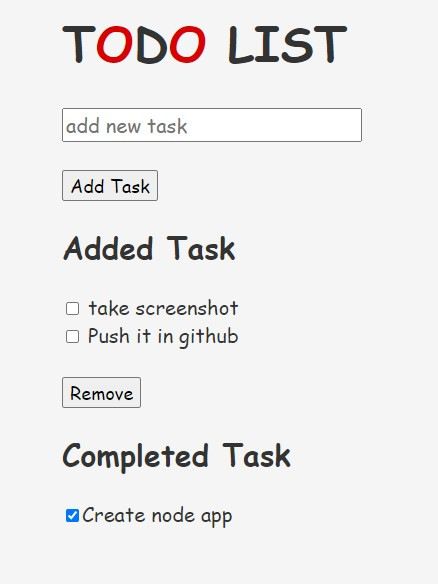

# TODO-List

**A simple ToDo List using NodeJS and a CSV file for storing data.**

**Steps:**
1. Download all the files.
2. In terminal type, "node index.js" and the server will run in localhost:2000 port.

***Note: NodeJS must be installed for this to work...*** 

